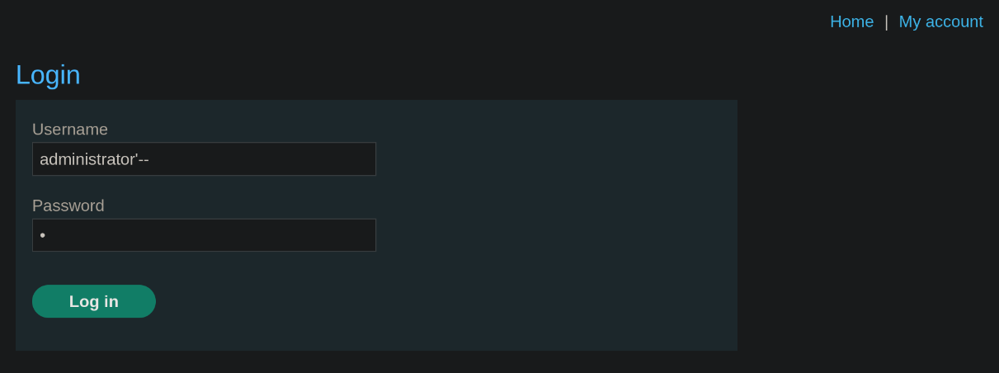
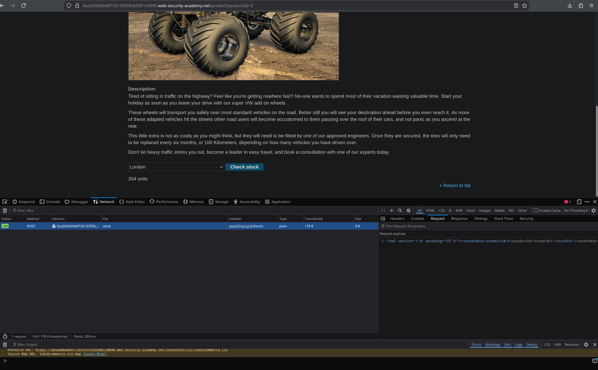
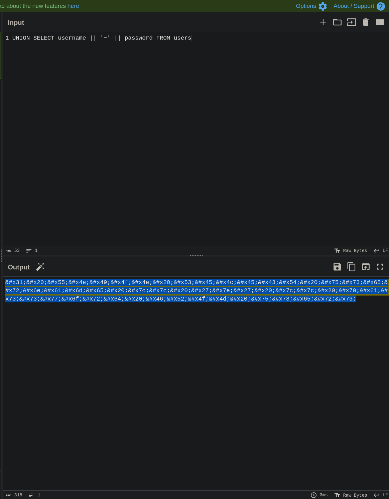
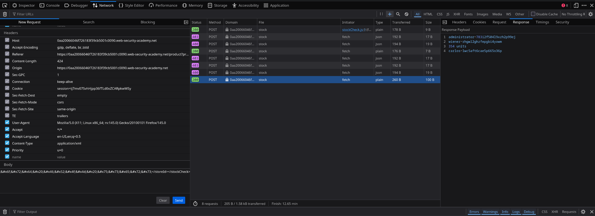

# SQL Injection Fundamentals: Login Bypass and XML Encoding Filter Evasion

**Labs Covered:**
- **Lab 1:** SQL injection vulnerability allowing login bypass
- **Lab 2:** SQL injection with filter bypass via XML encoding

**Platform:** PortSwigger Web Security Academy  
**Date Completed:** November 27, 2025  
**Tools Used:** Browser dev tools, CyberChef, manual SQL injection analysis

## Executive Summary
Two SQL injection vulnerabilities demonstrate defense evasion progression: from exploiting absent input validation (authentication bypass) to bypassing implemented WAF protections (XML encoding). The labs illustrate why defense-in-depth matters—single-layer protections fail when developers don't address root causes through parameterized queries.

## Lab 1: Authentication Bypass via SQL Comment Injection

The application accepts user credentials through a login form that constructs an SQL query without input sanitization:

```SQL
SELECT * FROM users WHERE username = '$input' AND password = '$input'
```

When the query returns a valid user record, authentication succeeds and the session is created for that user. Consider a standard login attempt where credentials `admin` / `wrong123` are submitted:

```SQL
SELECT * FROM users WHERE username = 'admin' AND password = 'wrong123'
```

The database searches for a record matching both the username and password. With invalid credentials, no record is returned and authentication fails.

The lack of input sanitization and prepared statements enables SQL injection. By submitting `administrator'-- ` as the username, the constructed query becomes:

```SQL
SELECT * FROM users WHERE username = 'administrator'-- ' AND password = ''
```

The `--` sequence initiates a SQL comment, causing the database to ignore everything after it, including the password check. The effective query becomes:

```SQL
SELECT * FROM users WHERE username = 'administrator'
```

The database searches for a user with the username of `administrator`, without checking if the provided password is correct. This allows authentication bypass to the administrator account without valid credentials. 

### Exploitation Analysis

The `administrator'-- ` payload achieves authentication bypass through three mechanisms:

1. **Single-quote termination** closes the username string boundary
2. **Comment injection** (`--`) neutralizes the password validation logic
3. **Trailing space** ensures comment syntax validity across database engines



The application granted administrative access without password validation, confirming direct string concatenation in the authentication query.

### Impact and Remediation

**Impact:**
Authentication bypass through SQL comment injection provides immediate administrative access without credential knowledge. This vulnerability enables:
- Complete account takeover of privileged users
- Access to administrative functions and sensitive data
- Potential for persistent access through account manipulation
- Lateral movement using extracted credentials from database queries

**Remediation:**
Parameterized queries (prepared statements) separate SQL logic from user data, preventing injection attacks regardless of input content. This approach ensures user input is treated as data values rather than executable SQL code:

```python
# Vulnerable: String concatenation
query = "SELECT * FROM users WHERE username = '" + user_input + "'"

# Secure: Parameterized query
query = "SELECT * FROM users WHERE username = ?"
cursor.execute(query, (user_input,))
```

## Lab 2: Filter Bypass via XML Encoding

### Environment Analysis and Filter Testing

The lab scenario indicated the presence of WAF-based SQL injection protections on the stock-checking feature. Using browser dev tools to inspect the stock-checking functionality revealed XML-formatted requests with the following structure:

```xml
<?xml version="1.0" encoding="UTF-8"?>
<stockCheck>
  <productId>1</productId>
  <storeId>1</storeId>
</stockCheck>
```

This query checks the database for how many of a certain product are in stock in a specific store.

**Filter Behavior Testing:**

To identify which patterns triggered blocking, individual SQL keywords were tested systematically in the `storeId` parameter:

- `SELECT` → Blocked
- `UNION` → Blocked
- `FROM` → Blocked
- `'` (single quote) → Blocked

The filter operated on keyword-based pattern matching. Further testing revealed the scope: encoding individual characters within blocked keywords allowed them to bypass detection. For example, encoding only the 'S' in SELECT (`&#x53;ELECT`) successfully evaded the filter, confirming that the WAF inspected requests before XML entity decoding occurred.

### XML Encoding Bypass Strategy

The XML request format presented a known evasion opportunity. XML parsers decode entity references (like `&#x53;` for 'S') before passing data to application logic. If the WAF scans for keywords before entity decoding, fully encoded payloads would bypass pattern matching while executing properly after the XML parser processes them.

**Processing Order:**
1. WAF inspects raw XML → sees `&#x53;&#x45;&#x4c;&#x45;&#x43;&#x54;` (numeric entities)
2. XML parser decodes entities → converts to "SELECT"
3. Application executes decoded SQL query

This architecture allows complete keyword encoding to evade detection.

### Exploitation Implementation

If the WAF were not implemented, the following request would have returned all users and passwords within the users database:
```xml
<stockCheck>  
  <productId>1</productId>  
  <storeId>1 UNION SELECT username || '~' || password FROM users</storeId>  
</stockCheck>
```
This union injection would return the amount of stock, as well as a list of all users and their passwords, in the form `<username>~<password>`. This concatenation is done because the application can only return one column, so the usernames and passwords must be combined.

However, the WAF prevents this injection from working because it is programmed to prevent patterns that are often used in SQL injection attacks from reaching the database. Within the above command, the prevented patterns are:
- `SELECT`
- `UNION`
- `'`

Malicious SQL can bypass the WAF by converting these patterns to their XML equivalents because the request uses XML encoding. The following request bypasses the WAF through XML encoding:
```xml
<stockCheck>  
  <productId>1</productId>  
  <storeId>  
  &#x31;&#x20;&#x55;&#x4e;&#x49;&#x4f;&#x4e;&#x20;&#x53;&#x45;&#x4c;&#x45;&#x43;&#x54;&#x20;&#x75;&#x73;&#x65;&#x72;&#x6e;&#x61;&#x6d;&#x65;&#x20;&#x7c;&#x7c;&#x20;&#x27;&#x7e;&#x27;&#x20;&#x7c;&#x7c;&#x20;&#x70;&#x61;&#x73;&#x73;&#x77;&#x6f;&#x72;&#x64;&#x20;&#x46;&#x52;&#x4f;&#x4d;&#x20;&#x75;&#x73;&#x65;&#x72;&#x73;
  </storeId>  
</stockCheck>
```
This will perform the same actions as `1 UNION SELECT username || '~' || password FROM users` but will also bypass the filter, which is searching for specific characters and character patterns within the request. This request now returns a list of all usernames and passwords in the users table.  

### Exploitation Analysis

Browser dev tools enabled direct manipulation of the XML stock-checking request. The SQL injection payload `1 UNION SELECT username || '~' || password FROM users` required full XML hexadecimal encoding to evade the keyword filter. CyberChef converted the payload to entity-encoded format, transforming each character to its hexadecimal XML entity representation.





Submitting the encoded request bypassed WAF filtering and returned concatenated credentials from the users table in `username~password` format:



The extracted administrator credentials enabled full account takeover, demonstrating complete WAF evasion through XML entity encoding.

### Impact and Remediation

**Impact:**
WAF bypass through XML encoding exposes critical limitations of pattern-based filtering as a primary defense. This vulnerability demonstrates:
- False security confidence from implemented protections
- Credential harvesting despite security controls
- Potential for lateral movement through password reuse across systems
- Business risk from relying on blacklist-based input validation

**Remediation:**
Defense-in-depth requires addressing root causes rather than relying solely on perimeter controls:

**Primary Defense:**
Parameterized queries prevent injection regardless of encoding schemes or filter bypass techniques.

**Supporting Defenses:**
- Input validation using allowlists for expected data formats
- XML parser configuration to disable or restrict entity processing
- WAF rules as supplementary protection, not primary defense
- Database accounts with least-privilege permissions to limit exploitation impact

Pattern-based filtering alone fails because attackers can leverage encoding variations (Base64, Unicode, HTML entities, URL encoding) to evade detection. Secure coding practices at the application layer remain the only reliable mitigation.

